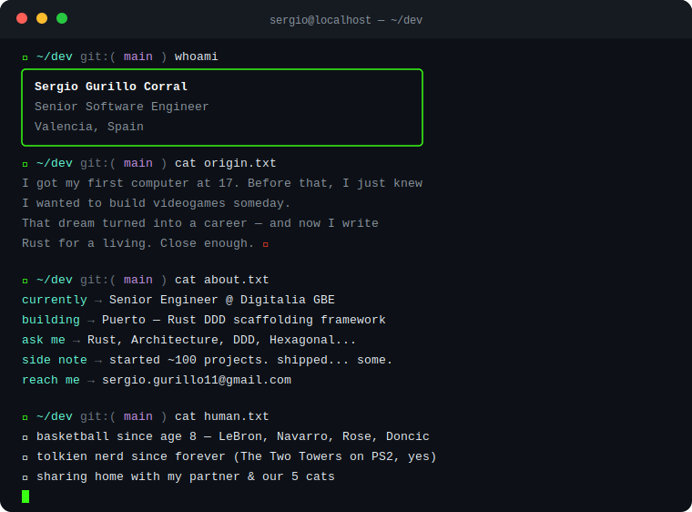

<div align="center">


<br/>


</div>

---

<div align="center">
  
</div>

---

```bash
$ ls ~/projects/featured
```

### 🚢 [Puerto](https://puerto-rs.vercel.app) — Rust CLI framework for DDD full-stack scaffolding

> Scaffold complete Domain-Driven Design projects in seconds.
> Opinionated by design. Fast by nature. Built in Rust.

[](https://puerto-rs.vercel.app)

---

```bash
$ cat stack.json | jq .languages
```


```bash
$ cat stack.json | jq .tools
```


```bash
$ cat stack.json | jq .principles
```

`Domain-Driven Design` `Hexagonal Architecture` `Event-Driven` `TDD` `SOLID`

---

```bash
$ git log --oneline --graph --all
```

<p align="center">
  
</p>
<p align="center">
  
</p>

---

```bash
$ cat contact.txt
```

<p align="left">
  <a href="https://sergiogurillo.framer.website/" target="_blank">
    
  </a>
  <a href="https://linkedin.com/in/sergio-gurillo-corral" target="_blank">
    
  </a>
  <a href="https://dev.to/guuri11" target="_blank">
    
  </a>
  <a href="mailto:sergio.gurillo11@gmail.com">
    
  </a>
</p>

---

<div align="center">
  <sub><i>// "Not all those who wander are lost." — but most of my side projects are.</i></sub>
</div>
